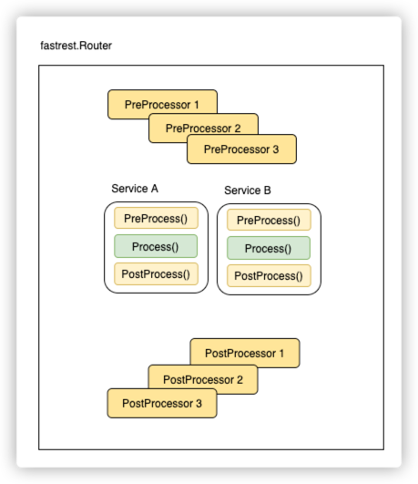

# fastrest

fast restful framework for golang.



2. Create your app directory, like `mkdir myapp; cd myapp; go mod init myapp;`
3. Create initial config.toml in a folder `initassets`, [example](cmd/fastrest/initassets/conf.yml)
   ```yaml
   ---
   addr: ":14142"
    ```
4. Create main code, [example](cmd/fastrest/main.go)
   ```go
   package main

   import (      
       "embed"
       "github.com/bingoohuang/fastrest"
   )

   //go:embed initassets
   var InitAssets embed.FS
   
   func main() { 
       // 注册路由
       router := fastrest.New(map[string]fastrest.Service{
           "GET /status":  &fastrest.Status{},
           "POST /p1sign": &fastrest.P1Sign{},
       })

       args := fastrest.ParseArgs(&InitAssets)
       args.Run(router)
   }
   ```
5. Create Makefile, [example](Makefile)
6. Build `make`
7. Create initial conf.toml and ctl: `myapp -init`
8. Startup `./ctl start`, you can set env `export GOLOG_STDOUT=true` before startup to view the log in stdout for
   debugging.
9. Performance testing using [berf](https://github.com/bingoohuang/berf): `berf :14142/status -d15s -v`
10. Or single test `berf :14142/p1sign -v source=bingoo bizType=abc -n1`

```sh
➜  fastrest git:(main) ✗ berf :14142/p1sign source=bingoo bizType=abc -pRr -n1
### 127.0.0.1:63079->127.0.0.1:14142 time: 2022-01-05T14:19:36.312775+08:00 cost: 575.239µs
POST /p1sign HTTP/1.1
User-Agent: blow
Host: 127.0.0.1:14142
Content-Type: application/json; charset=utf-8
Content-Length: 36
Accept-Encoding: gzip, deflate

{"bizType":"abc","source":"bingoo"}

HTTP/1.1 200 OK
Server: fasthttp
Date: Wed, 05 Jan 2022 06:19:36 GMT
Content-Type: application/json; charset=utf-8
Content-Length: 19

{"source":"bingoo"}
```

## easyjson marshalling and unmarshalling

1. Install [easyjson tool](https://github.com/bingoohuang/easyjson)
1. Tag the model, see the following example.
2. Generate easyjson codes: `easyjson yourmodel.go`

```go
//easyjson:json
type Service1Req struct {
Source  string
BizType string
}

//easyjson:json
type Service1Rsp struct {
Source string
}
```

## Global PreProcessor and PostProcessor

```go
// 注册路由
router := fastrest.New(map[string]fastrest.Service{
	"GET /status":  &fastrest.Status{},
	"POST /p1sign": &fastrest.P1Sign{},
}, fastrest.WithPreProcessor(fastrest.PreProcessorFn(func(dtx *fastrest.Context) error {
	// 全局前置处理器
	return nil
})), fastrest.WithPostProcessor(fastrest.PostProcessorFn(func(dtx *fastrest.Context) error {
	// 全局后置处理器
	return nil
})))
```