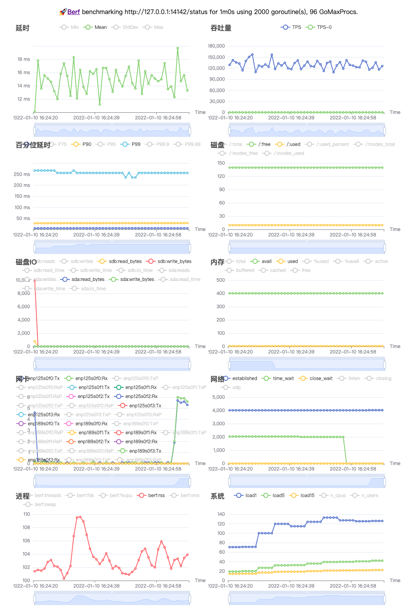

# `/status` api performance

## sysinfo

```sh
root@xb-PC:~/bingoohuang# ./sysinfo
+---+----------+--------+--------------+-------+-------+----------+--------------------------------------+------------------+---------------------+-------------+-----------------------------+
| # | HOSTNAME | UPTIME | UPTIME HUMAN | PROCS | OS    | PLATFORM | HOST ID                              | PLATFORM VERSION | KERNEL VERSION      | KERNEL ARCH | OS RELEASE                  |
+---+----------+--------+--------------+-------+-------+----------+--------------------------------------+------------------+---------------------+-------------+-----------------------------+
| 1 | xb-PC  | 438940 | 5 days       |   973 | linux | debian   | 47972b6d-4467-bd82-ea11-b31cdead1e8f | 10.3             | 4.19.0-arm64-server | aarch64     | NAME="uos" VERSION="20 SP1" |
+---+----------+--------+--------------+-------+-------+----------+--------------------------------------+------------------+---------------------+-------------+-----------------------------+

+---+----------+----------+-----------+-----------------+
| # | TOTAL    | FREE     | AVAILABLE | USED PERCENTAGE |
+---+----------+----------+-----------+-----------------+
| 1 | 377.6GiB | 370.5GiB | 373.2GiB  | 00.62%          |
+---+----------+----------+-----------+-----------------+

+---+-------------+-----------+--------+------------------+-------+-----+
| # | PHYSICAL ID | VENDOR ID | FAMILY | MODEL NAME       | CORES | MHZ |
+---+-------------+-----------+--------+------------------+-------+-----+
| 1 |             | HiSilicon |        | Kunpeng 920-4826 |    96 |   0 |
+---+-------------+-----------+--------+------------------+-------+-----+

+---+-----------+-----------+--------+----------+----------+----------+--------------+
| # | PATH      | DEVICE    | FSTYPE | TOTAL    | USED     | FREE     | USED PERCENT |
+---+-----------+-----------+--------+----------+----------+----------+--------------+
| 1 | /         | /dev/sda3 | ext4   | 146.6GiB | 9.969GiB | 129.2GiB | 07.17%       |
| 2 | /boot     | /dev/sda2 | "      | 1.445GiB | 178.2MiB | 1.18GiB  | 12.85%       |
| 3 | /boot/efi | /dev/sda1 | vfat   | 299.4MiB | 428KiB   | 299MiB   | 00.14%       |
| 4 | /recovery | /dev/sda5 | ext4   | 9.781GiB | 9.765GiB | 0B       | 100.00%      |
| 5 | /data     | /dev/sda4 | "      | 923.1GiB | 14.61GiB | 861.6GiB | 01.67%       |
| 6 | /var      | "         | "      | "        | "        | "        | "            |
| 7 | /opt      | "         | "      | "        | "        | "        | "            |
| 8 | /home     | "         | "      | "        | "        | "        | "            |
| 9 | /root     | "         | "      | "        | "        | "        | "            |
+---+-----------+-----------+--------+----------+----------+----------+--------------+

+---+----------------+-------------------+------------------------------------------------+
| # | INTERFACE NAME | HARDWARE ADDR     | ADDRS                                          |
+---+----------------+-------------------+------------------------------------------------+
| 1 | enp125s0f0     | 44:67:47:97:2b:6f | 192.168.1.1/24 fe80::2987:1d0e:899f:e026/64 |
+---+----------------+-------------------+------------------------------------------------+
```

## berf

```sh
root@xb-PC:~/bingoohuang# ./berf :14142/status -c 2000 -v -d1m
Berf benchmarking http://127.0.0.1:14142/status for 1m0s using 2000 goroutine(s), 96 GoMaxProcs.
@Real-time charts is on http://127.0.0.1:28888

Summary:
  Elapsed                  1m0.021s
  Count/RPS      7683366 128009.817
    200          7683366 128009.817
  ReadWrite    199.695 167.992 Mbps
  Connections                  2000

Statistics    Min      Mean      StdDev      Max
  Latency    29µs    14.952ms   38.947ms  594.352ms
  RPS       92431.2  127927.24  12308.26  157744.48

Latency Percentile:
  P50        P75      P90       P95        P99       P99.9     P99.99
  5.615ms  14.01ms  28.846ms  43.509ms  255.746ms  395.567ms  478.152ms

Latency Histogram:
  8.613ms    6708823  87.32%  ■■■■■■■■■■■■■■■■■■■■■■■■■■■■■■■■■■■■■■■■
  27.154ms    739405   9.62%  ■■■■
  101.032ms   170051   2.21%  ■
  275.351ms    41279   0.54%
  339.642ms    17178   0.22%
  396.597ms     6164   0.08%
  423.246ms      431   0.01%
  446.104ms       35   0.00%
```

